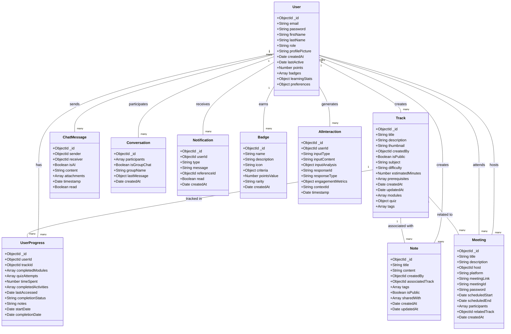
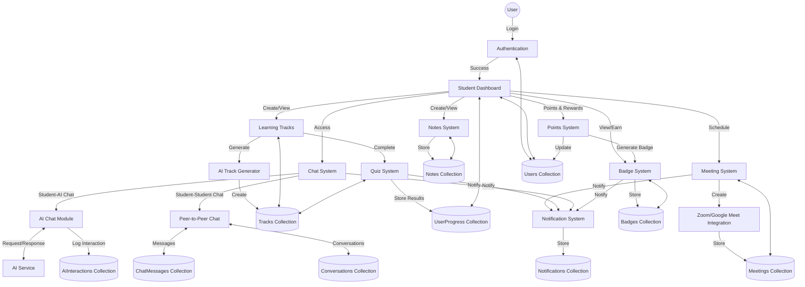

## System Architecture Overview

The learning platform will be built with a modern stack:

1. **Frontend**: 
   - Next.js for the UI with SSR capabilities
   - Redux or Context API for state management
   - WebSocket for real-time chat functionality
   - Tailwind CSS for responsive design

2. **Backend**:
   - Python with FastAPI for performance and type safety
   - MongoDB for flexible document storage
   - Authentication with JWT/OAuth
   - Integration with third-party APIs:
     - AI service (OpenAI/Anthropic)
     - Zoom/Google Meet APIs
     - WebRTC for peer-to-peer video

3. **AI Components**:
   - Track generation service
   - Chatbot with context awareness
   - Content recommendation engine
   - Progress analysis and adaptive learning

4. **Infrastructure**:
   - AWS/Azure/GCP for cloud hosting
   - CDN for content delivery
   - S3 or similar for file storage
   - Redis for caching and real-time features

5. **Security**:
   - HTTPS throughout
   - Data encryption at rest and in transit
   - Input validation
   - Rate limiting
   - Authentication and authorization checks

This architecture provides scalability, flexibility, and the right foundation for an AI-enhanced learning platform.# Learning Platform Database & Architecture Design

## MongoDB Collections Structure

### 1. Users Collection
```
{
  _id: ObjectId,
  email: String,
  password: String (hashed),
  firstName: String,
  lastName: String,
  role: String (student/teacher/admin),
  profilePicture: String (URL),
  createdAt: Date,
  lastActive: Date,
  points: Number,
  badges: [ObjectId], // References to Badge collection
  learningStats: {
    averageSessionTime: Number,
    totalActiveDays: Number,
    streakDays: Number,
    subjectProgress: Object
  },
  preferences: {
    notifications: Boolean,
    theme: String,
    language: String
  }
}
```

### 2. Tracks Collection
```
{
  _id: ObjectId,
  title: String,
  description: String,
  thumbnail: String, // URL
  createdBy: ObjectId (ref: Users),
  isPublic: Boolean,
  subject: String,
  difficulty: String (beginner/intermediate/advanced),
  estimatedMinutes: Number,
  prerequisites: [ObjectId], // References to other Tracks
  createdAt: Date,
  updatedAt: Date,
  modules: [
    {
      moduleId: ObjectId,
      title: String,
      content: String (rich text/markdown),
      order: Number,
      resources: [
        {
          type: String (video/document/link),
          url: String,
          title: String,
          duration: Number // in minutes
        }
      ],
      activities: [
        {
          type: String,
          instructions: String,
          pointsValue: Number
        }
      ]
    }
  ],
  quiz: {
    questions: [
      {
        question: String,
        options: [String],
        correctOption: Number,
        explanation: String
      }
    ],
    passingScore: Number
  },
  tags: [String]
}
```

### 3. UserProgress Collection
```
{
  _id: ObjectId,
  userId: ObjectId (ref: Users),
  trackId: ObjectId (ref: Tracks),
  completedModules: [ObjectId],
  quizAttempts: [
    {
      attemptDate: Date,
      score: Number,
      answers: [Number]
    }
  ],
  timeSpent: Number, // in minutes
  completedActivities: [Number], // Indices of completed activities
  lastAccessed: Date,
  completionStatus: String (not-started/in-progress/completed),
  notes: String,
  startDate: Date,
  completionDate: Date
}
```

### 4. ChatMessages Collection
```
{
  _id: ObjectId,
  sender: ObjectId (ref: Users),
  receiver: ObjectId (ref: Users), // null if AI chatbot
  isAI: Boolean,
  content: String,
  contentType: String, // "text", "image", "file"
  attachments: [
    {
      filename: String,
      url: String,
      type: String // MIME type
    }
  ],
  timestamp: Date,
  read: Boolean
}
```

### 5. Conversations Collection
```
{
  _id: ObjectId,
  participants: [ObjectId (ref: Users)],
  isGroupChat: Boolean,
  groupName: String, // if group chat
  lastMessage: {
    content: String,
    sender: ObjectId (ref: Users),
    timestamp: Date
  },
  createdAt: Date
}
```

### 6. Notes Collection
```
{
  _id: ObjectId,
  title: String,
  content: String (rich text/markdown),
  createdBy: ObjectId (ref: Users),
  associatedTrack: ObjectId (ref: Tracks), // optional
  tags: [String],
  isPublic: Boolean,
  sharedWith: [ObjectId (ref: Users)],
  attachments: [
    {
      filename: String,
      url: String,
      type: String // MIME type
    }
  ],
  createdAt: Date,
  updatedAt: Date
}
```

### 7. Meetings Collection
```
{
  _id: ObjectId,
  title: String,
  description: String,
  host: ObjectId (ref: Users),
  platform: String (zoom/google-meet),
  meetingLink: String,
  meetingId: String,
  password: String, // optional
  scheduledStart: Date,
  scheduledEnd: Date,
  participants: [ObjectId (ref: Users)],
  relatedTrack: ObjectId (ref: Tracks), // optional
  topics: [String],
  status: String, // "scheduled", "active", "completed", "cancelled"
  createdAt: Date
}
```

### 8. Notifications Collection
```
{
  _id: ObjectId,
  userId: ObjectId (ref: Users),
  type: String (meeting/message/track/quiz),
  message: String,
  referenceId: ObjectId, // reference to related document
  read: Boolean,
  createdAt: Date
}
```

### 9. Badges Collection
```
{
  _id: ObjectId,
  name: String,
  description: String,
  icon: String, // URL
  criteria: {
    type: String, // "points", "streak", "completion", "activity"
    threshold: Number,
    subject: String // Optional
  },
  pointsValue: Number,
  rarity: String, // "common", "uncommon", "rare", "legendary"
  createdAt: Date
}
```

### 10. AIInteractions Collection
```
{
  _id: ObjectId,
  userId: ObjectId (ref: Users),
  inputType: String, // "text", "voice", "visual", "multimodal"
  inputContent: String, // Text input or transcript of voice
  inputAnalysis: {
    sentiment: String,
    intent: String,
    confidence: Number,
    entities: [Object]
  },
  responseId: String, // ID of AI response
  responseType: String, // "text", "visual", "multimodal"
  engagementMetrics: {
    responseTime: Number, // in ms
    followupQuestions: Number,
    userSatisfaction: Number // if feedback provided
  },
  contextId: String, // Conversation context
  timestamp: Date
}
```

## Class Diagram



## Data Flow Diagram (DFD)



## API Endpoints Structure

### Authentication Endpoints
- POST /api/auth/register
- POST /api/auth/login
- POST /api/auth/logout
- GET /api/auth/verify
- POST /api/auth/reset-password

### User Endpoints
- GET /api/users/:id
- PUT /api/users/:id
- GET /api/users/:id/progress
- GET /api/users/:id/badges
- GET /api/users/:id/points
- POST /api/users/:id/award-points
- POST /api/users/:id/award-badge/:badgeId

### Learning Track Endpoints
- GET /api/tracks
- POST /api/tracks
- GET /api/tracks/:id
- PUT /api/tracks/:id
- DELETE /api/tracks/:id
- GET /api/tracks/search
- GET /api/tracks/:id/modules
- GET /api/tracks/:id/recommend
- POST /api/tracks/generate
- GET /api/tracks/popular
- GET /api/tracks/recommended-for-user/:userId

### Module & Quiz Endpoints
- GET /api/modules/:id
- PUT /api/modules/:id
- POST /api/modules/:id/complete
- GET /api/modules/:id/progress
- POST /api/quiz/submit
- GET /api/quiz/:trackId

### Notes Endpoints
- GET /api/notes
- POST /api/notes
- GET /api/notes/:id
- PUT /api/notes/:id
- DELETE /api/notes/:id
- POST /api/notes/:id/share
- GET /api/notes/track/:trackId
- GET /api/notes/shared-with-me

### Meeting Endpoints
- GET /api/meetings
- POST /api/meetings
- GET /api/meetings/:id
- PUT /api/meetings/:id
- DELETE /api/meetings/:id
- POST /api/meetings/:id/join
- GET /api/meetings/upcoming
- POST /api/meetings/:id/end

### Chat Endpoints
- GET /api/conversations
- POST /api/conversations
- GET /api/conversations/:id/messages
- POST /api/conversations/:id/messages
- GET /api/conversations/:id/participants
- POST /api/ai/message
- GET /api/conversations/unread

### Badge and Points Endpoints
- GET /api/badges
- GET /api/badges/:id
- GET /api/leaderboard
- GET /api/leaderboard/subject/:subject

### Notification Endpoints
- GET /api/notifications
- PUT /api/notifications/:id/read
- PUT /api/notifications/read-all
- GET /api/notifications/unread-count

### AI Endpoints
- POST /api/ai/generate-track 
- POST /api/ai/analyze-progress 
- POST /api/ai/recommend-content 
- POST /api/ai/generate-quiz 
- POST /api/ai/answering-assistant 